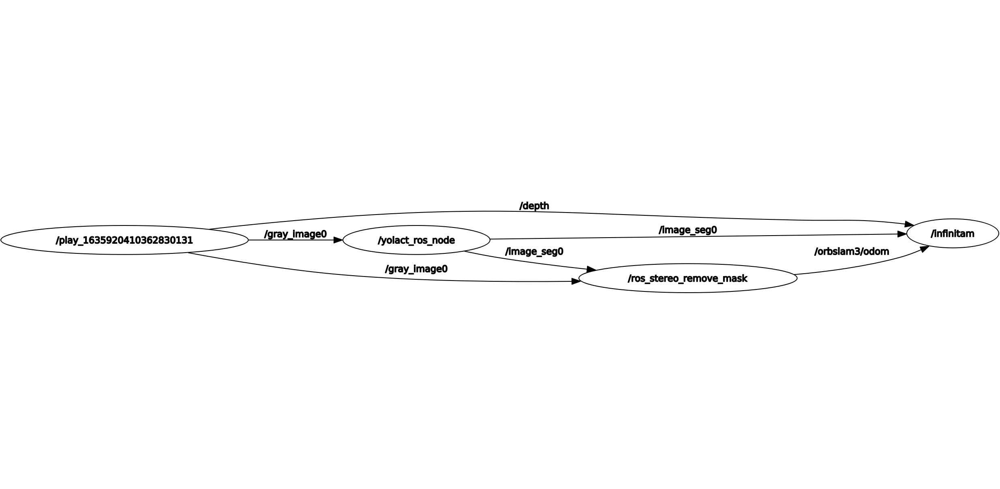
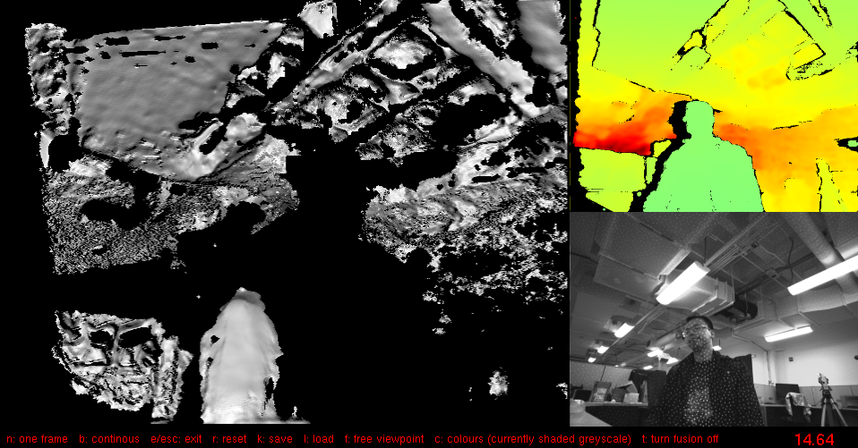
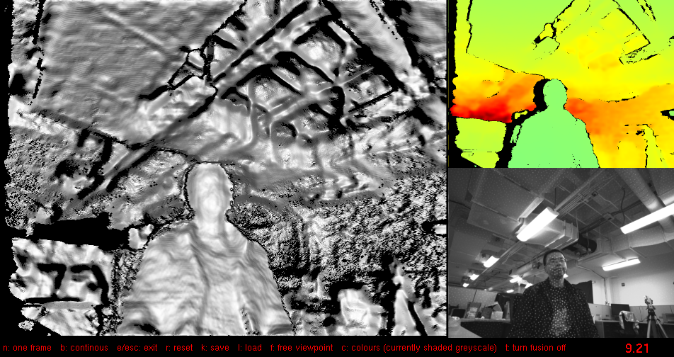

# DYNA_INFINI
A library that reconstructs the 3D environment with dynamic objects (either rigid body or has defromation).

## Intro
We build this library on top of InfiniTAM, ORBSLAM3 and Yolact. We use Yolact to provide the image segmentation, ORBSLAM3 to provide the pose estimation and the InfiniTAM to perform reconstruction. We use ROS to connect the sub-systems. The ROS `rqt_graph` is like the following  
  
We play a ROS bag contains stereo and depth image obtained by Intel Realsense. We send the depth to the Yolact. Yolact produces the required segmented image and send it to the SLAM system and the InfiniTAM. SLAM system sends the pose edtimation to the infiniTAM with the depth image from the camera. Please refer the thesis for the detail implementation and system description.

## Install
We **strongly** recommend you to build the library in the docker but you can still build it without docker. We have already build the docker image with all the dependencies in a seperate Ubuntu system. Install and run are pretty easy. However, the docker image size is large.  
**With docker**, for GPU RTX 20X, GTX 10X and most of the GPU before 2020. Pull the image
```
docker pull zhch5450/dynamic_3d_reconstruction_img:2
```
for new GPU like RTX 30x, pull the image
```
docker pull zhch5450/dynamic_3d_reconstruction_img:1
```
Then run the following for installation
```
git clone https://github.com/arpg/dyna_infini.git
cd dyna_infini/catkin_ws/src
git clone https://github.com/arpg/orbslam3_ros.git
cd ../../
./run_docker.sh
./buid.sh
```
`run_docker.sh` brings you into the docker container, then in the container you run the `build.sh` script. `build.sh` builds some external libraries for ORBSLAM. In the future, if you make futher modifications to this lib, you simply need the following to rebuild in the docker container
```
cd catkin_ws
catkin_make
```
**Without docker**  
We try not to add new dependencies to this lib so you just need to download the dependencies of the sub systems.  
https://github.com/dbolya/yolact  
https://github.com/UZ-SLAMLab/ORB_SLAM3  
https://github.com/victorprad/InfiniTAM  
You don't need to install the `optional` dependencies shown in those libraries. Then  
```
git clone https://github.com/arpg/dyna_infini.git
cd dyna_infini
./buid.sh
```
## Run
Download the pretrained model or your own Yolact model at https://github.com/dbolya/yolact. Put the model into the `yolact_ros/wieghts` folder.
Download our example dataset . You can either put the data in your local machine or in the docker image. 
If you **don't** want to handle the dynamic objects you can run the original IniniTAM. Open the `dyna_inifini/catkin_ws/src/dyna_infini/run_systems_realsense.launch`. Change the following value from `True` to `False`
```
    <param name="use_external_pose_estimation" type="bool" value="True" />
    <param name="dynamic_objects" type="bool" value="True" />
```
**With docker**  
If you put the dataset on your local machine and want to access the data in the docker container, open the `run_docker.sh`, find
```
-v /home/zhaozhong/dataset/arpg_realsensed455_3DM-GX5-15:/opt/dataset/realsense \
```
Replace the `/home/zhaozhong/dataset/arpg_realsensed455_3DM-GX5-15` with the dataset address on your local machine, replace the `/opt/dataset/realsense` with any address `A` you want to access the data. Then in your container, you can find the dataset in the `A` folder.  
```
./run_docker.sh
cd catkin_ws
source devel/setup.bash
roslaunch dyna_infini run_systems_realsense.launch
```
In another terminal
```
docker exec -it dyna_infini_container /bin/bash
cd catkin_ws
rosbag play YOUR_DATASET_ADDRESS
```
Press `n` or `b` in the window showing up to view the reconstruction like the original InfiniTAM  
**Without docker**
```
source devel/setup.bash
roslaunch dyna_infini run_systems_realsense.launch
```
In another terminal
```
cd catkin_ws
rosbag play YOUR_DATASET_ADDRESS
```
If you want to run with your own dataset, please let them publish the same topic as the example dataset or make the topic name correspondes with the topic name in the `run_systems_realsense.launch`  

## Example result
Run the test dataset Without dynamic detection
  
Run the test dataset with dynamic detection  


## More
We are going to adjust and add more features. If you use the related work, please cite
```
TO ADD the thesis
```


